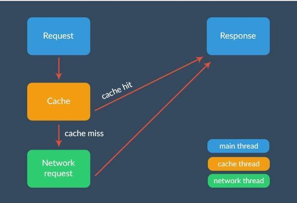

1. 请求队列：RequestQueue  用来缓存 request 的请求队列，根据优先级高低排列；
   Request:表示网络请求，本身是一个抽象类，子类有 StringRequest 、
   JsonRequest 、ImageRequest 等；
   Response ：表示网络请求后的响应，也是一个抽象类。内部定义了 Listener 、ErrorListener 接口；
NetworkResponse ：对返回的 HttpResponse 内容进行了封装，虽然类名和 Response 差不多，但是不是 Response 的子类；

2. 本地缓存：DiskBasedCache

sdk <= 9（2.3） 使用 AndroidHttpClinet
sdl > 9 使用 HttpUrlConnection
sdk > 19（4.4） HttpUrlConnection 底层用 OKHttp实现
3. 队列：PriorityBlockingQueue
4. 响应头解析：HttpHeaderParser
5. 缓存分发：CacheDispatcher
6. 网络请求分发：NetworkDispatcher
7. ResponseDelivery ：用作分发处理。利用 Handler 把结果回调到主线程中，
   即 Listener 、ErrorListener 接口。主要实现类为 ExecutorDelivery ；
8. HttpStack ：主要作用就是发起 Http 请求。子类分为 HurlStack 和 HttpClientStack ，分别对应着 HttpUrlConnection 和 HttpClient ；
9. Network ：处理 Stack 发起的 Http 请求，把 Request 转换为 Response ，
        主要实现类为 BasicNetwork ；
10. RetryPolicy ：请求重试策略。主要实现类为 DefaultRetryPolicy ；
11. Cache ：网络请求的缓存。在 CacheDispatcher 中获取 Cache ，在 NetworkDispatcher 中判断是否保存 Cache 。主要实现类为 DiskBasedCache ，缓存在磁盘中。

SSLContext
TrustManagerFactory
X509TrustManager
TrustManager

